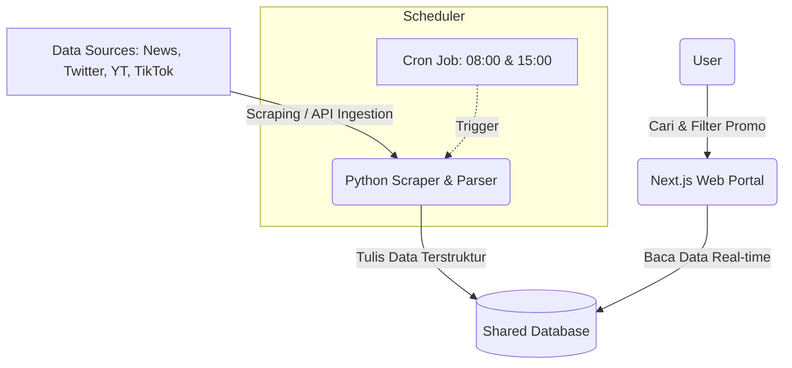

# Design Specification: Portal Promo Tiket Pesawat & Makanan
Tanggal: 2026-06-26
Status: Draft (Pending Approval)

---

## 1. Pendahuluan
Dokumen ini mendeskripsikan spesifikasi desain dan rancangan teknis untuk **Portal Promo**, sebuah platform web dinamis yang mengagregasikan informasi promosi tiket pesawat dan makanan. Informasi dikumpulkan secara otomatis dari berbagai sumber seperti berita online, media sosial (Twitter/Instagram), dan konten video (YouTube/TikTok).

### Tujuan Utama:
1. Menyediakan wadah terpusat bagi pengguna untuk menemukan promo tiket pesawat dan makanan terbaru.
2. Mengotomatiskan penarikan data dari multi-platform secara berkala tanpa intervensi manual yang konstan.
3. Menyajikan antarmuka pengguna yang bersih, responsif, dan mudah difilter sesuai kategori (Pesawat vs Makanan).

---

## 2. Arsitektur Sistem & Aliran Data
Sistem ini menggunakan pendekatan **Shared Database Architecture** dengan pemisahan peran antara pengumpul data (Scraper) dan penyaji data (Web Portal).



### Komponen Sistem:
1. **Python Ingestion Module (Backend/Scraper):**
   * Menggunakan Python karena keandalannya dalam penanganan web scraping dan library text processing.
   * Dijalankan menggunakan penjadwal Cron otomatis dua kali sehari pada jam **08:00** dan **15:00**.
2. **Shared Database (Penyimpanan):**
   * Menggunakan **SQLite** untuk keperluan pengembangan lokal dan testing.
   * Menggunakan **PostgreSQL** untuk lingkungan produksi.
3. **Next.js Web Application (Frontend & API):**
   * Menggunakan Next.js untuk frontend interaktif dengan Server-Side Rendering (SSR) untuk performa dan SEO yang optimal.
   * Membaca langsung database bersama untuk menampilkan promo secara real-time.

---

## 3. Skema Database
Database akan memiliki dua tabel terpisah untuk menampung dua kategori promo utama.

### 3.1. Tabel `flight_promos` (Promo Tiket Pesawat)
Menyimpan informasi terkait penerbangan dan maskapai.

| Nama Kolom | Tipe Data | Deskripsi |
| :--- | :--- | :--- |
| `id` | INTEGER (PK, AI) | ID unik entri promo. |
| `title` | VARCHAR(255) | Judul promo yang menarik. |
| `description` | TEXT | Keterangan lengkap, syarat umum, dan rincian. |
| `airline` | VARCHAR(100) | Nama maskapai penerbangan (contoh: Garuda Indonesia, AirAsia). |
| `origin_city` | VARCHAR(100) | Kota keberangkatan (opsional). |
| `destination_city`| VARCHAR(100) | Kota tujuan penerbangan (opsional). |
| `promo_code` | VARCHAR(50) | Kode promo (nullable). |
| `discount_value` | VARCHAR(100) | Besaran diskon (contoh: "20%", "Potongan Rp 500.000"). |
| `terms_and_conditions` | TEXT | Syarat dan ketentuan khusus (nullable). |
| `source_platform` | VARCHAR(50) | Asal data (YouTube, TikTok, Twitter, News). |
| `source_url` | TEXT | Tautan langsung ke konten asli. |
| `expired_date` | DATE | Masa berlaku promo (kedalwarsa). |
| `created_at` | TIMESTAMP | Tanggal rilis promo. |
| `scraped_at` | TIMESTAMP | Tanggal data ditarik oleh sistem. |

### 3.2. Tabel `food_promos` (Promo Makanan & Minuman)
Menyimpan informasi promosi restoran, kafe, dan brand F&B.

| Nama Kolom | Tipe Data | Deskripsi |
| :--- | :--- | :--- |
| `id` | INTEGER (PK, AI) | ID unik entri promo. |
| `title` | VARCHAR(255) | Judul promo yang menarik. |
| `description` | TEXT | Keterangan lengkap. |
| `brand_name` | VARCHAR(100) | Nama brand/restoran (contoh: KFC, McDonald's, Starbucks). |
| `category` | VARCHAR(100) | Kategori kuliner (Fast Food, Coffee, Dessert, dll). |
| `min_transaction` | VARCHAR(100) | Batas minimal pembelian untuk mendapatkan promo (nullable). |
| `promo_code` | VARCHAR(50) | Kode promo jika ada (nullable). |
| `discount_value` | VARCHAR(100) | Besaran diskon (contoh: "Diskon 50%", "Beli 1 Gratis 1"). |
| `terms_and_conditions` | TEXT | Syarat dan ketentuan khusus (nullable). |
| `locations` | VARCHAR(255) | Lokasi berlakunya promo (contoh: "Nasional", "Jabodetabek", "Cabang PIM"). |
| `source_platform` | VARCHAR(50) | Asal data (YouTube, TikTok, Twitter, News). |
| `source_url` | TEXT | Tautan langsung ke konten asli. |
| `expired_date` | DATE | Masa berlaku promo (kedalwarsa). |
| `created_at` | TIMESTAMP | Tanggal rilis promo. |
| `scraped_at` | TIMESTAMP | Tanggal data ditarik oleh sistem. |

---

## 4. Alur Kerja Scraping Engine (Python)
Script Python akan berjalan dua kali sehari secara otomatis dengan mekanisme kerja sebagai berikut:

```
[Mulai Jadwal: 08:00 / 15:00]
              ↓
  [Unduh Mentah dari Sumber] ──> (Berita RSS, Twitter API/Scrape, YouTube API, TikTok Scraper)
              ↓
  [Pembersihan & Parsing Text] ──> Menggunakan Regex & Model NLP/LLM untuk ekstraksi field terstruktur
              ↓
  [Validasi & Deduplikasi] ──> Cek jika 'source_url' sudah ada di DB untuk menghindari spam
              ↓
  [Tulis ke Database] ──> Simpan promo baru ke tabel flight_promos/food_promos
              ↓
[Selesai & Log Status Ingesti]
```

1. **Pengunduhan Konten:** Menggunakan HTTP Client atau SDK platform terkait untuk mengunduh postingan terbaru berdasarkan kata kunci relevan (e.g., "promo tiket", "diskon makanan").
2. **Ekstraksi Entitas (Parsing):**
   * **Regex Matcher:** Untuk mengekstrak tanggal kedaluwarsa, kode promo (biasanya UPPERCASE dengan kombinasi angka), dan nominal diskon (simbol `%` atau `Rp`).
   * **NLP/LLM Helper:** Parser cerdas untuk memahami konteks kota asal-tujuan pada tiket pesawat, nama brand F&B, dan syarat ketentuan.
3. **Deduplikasi:** Sebelum data disimpan, sistem memverifikasi `source_url` untuk menjamin tidak ada promo ganda yang ditampilkan di web portal.

---

## 5. Tampilan Antarmuka (UI & UX)
Desain visual akan disajikan dalam antarmuka web modern dengan gaya gelap/terang yang kontras dan bersih.

### Fitur Utama Frontend:
1. **Navigasi Tab:** Pemisahan tegas antara tab "Tiket Pesawat" dan "Makanan & Minuman" untuk menghindari kekacauan informasi.
2. **Pencarian Cepat & Filter:**
   * Filter Maskapai, Kota Asal, dan Kota Tujuan di tab Penerbangan.
   * Filter Kategori Makanan, Brand Restoran, dan Lokasi Wilayah di tab Kuliner.
3. **Komponen Kartu Promo (Promo Card):**
   * **Badge Sumber:** Menampilkan ikon platform (YouTube, Twitter/X, News) agar user tahu asal promo.
   * **Penyalinan Kode Sekali Klik:** Tombol interaktif untuk menyalin `promo_code` secara instan ke clipboard.
   * **Penanda Kedaluwarsa:** Visualisasi sisa hari aktif promo (akan berubah warna merah jika tersisa kurang dari 2 hari).
   * **Tautan Langsung:** Tombol "Lihat Sumber" yang membuka tab baru ke media tempat promo tersebut pertama kali diposting.

---

## 6. Rencana Implementasi & Milestone
Pengembangan portal promo ini akan dibagi menjadi 4 tahap terencana:

* **Tahap 1: Inisiasi Proyek & Database (Hari 1)**
  * Setup repositori Git.
  * Inisialisasi database SQLite dan migrasi tabel (`flight_promos` & `food_promos`).
  * Inisialisasi project Next.js.
* **Tahap 2: Pengembangan Scraping Engine (Hari 2-3)**
  * Membuat script Python scraper untuk berita (RSS Reader) dan sosial media.
  * Membuat logika parser untuk ekstraksi kode promo, tanggal kedaluwarsa, dan terms & conditions.
  * Setup Cron Job penjadwalan lokal (8 AM & 3 PM).
* **Tahap 3: Pembuatan Dashboard Web (Hari 4)**
  * Integrasi Next.js dengan Database.
  * Pembuatan layout tabbed, filter pencarian, dan desain responsif kartu promo.
  * Implementasi fitur "Copy to Clipboard" untuk kode promo.
* **Tahap 4: Pengujian & Penyempurnaan (Hari 5)**
  * Pengujian end-to-end (penarikan data hingga tampil di web).
  * Optimasi query dan caching di Next.js.
  * Deployment panduan & dokumentasi akhir.
