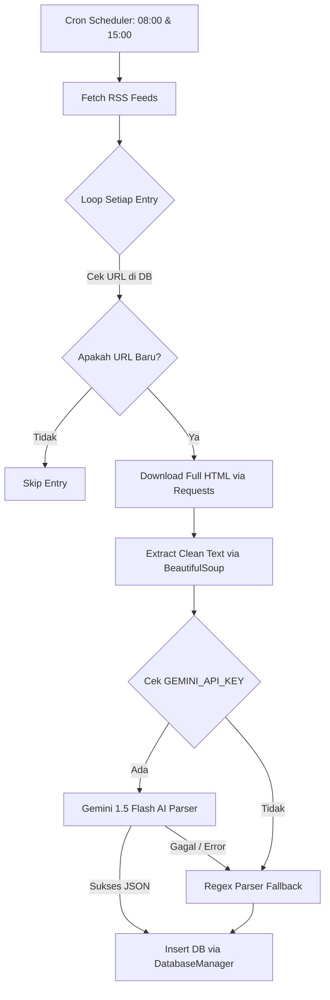

# Design Specification: RSS Deep Scraper & Gemini AI Parser
Tanggal: 2026-06-26
Status: Draft (Pending Approval)

---

## 1. Pendahuluan
Dokumen ini mendeskripsikan spesifikasi desain untuk pengembangan modul tambahan **RSS Deep Scraper & Gemini AI Parser** pada Portal Promo. Modul ini bertujuan menggantikan simulasi data mock dengan penarikan data promo berita riil secara berkala dari portal berita Indonesia (seperti Detikcom dan Antaranews) dan memprosesnya secara cerdas menggunakan kecerdasan buatan (Gemini LLM) untuk ekstraksi informasi berakurasi tinggi.

---

## 2. Alur Ingesti & Arsitektur Deep Scraper
Sistem akan memeriksa RSS feed untuk artikel baru, lalu menarik isi halaman penuh dari artikel tersebut untuk dianalisis.



### Detil Komponen:
1. **RSS Ingestion:** Mengambil feed XML dari RSS berita menggunakan library `feedparser`.
2. **Deduplication Gate:** Membandingkan URL artikel (`link`) dengan kolom `source_url` di database. Jika sudah terdaftar, proses scraping dihentikan lebih awal untuk menghemat jaringan.
3. **HTML Downloader & BeautifulSoup Extractor:**
   * Mengunduh HTML halaman penuh dengan penanganan user-agent palsu dan timeout.
   * Ekstraktor menggunakan `BeautifulSoup` untuk menyaring tag skrip, style, komentar, dan hanya mengambil teks utama di dalam tag penampung (seperti `<article>` atau `.detail__body-text`).

---

## 3. Integrasi Gemini AI Parser
Untuk menjamin hasil ekstraksi data promo yang berkualitas tinggi dari teks berita natural, parser akan mengadopsi integrasi model Gemini.

### Skema Pemrosesan:
* **Library:** `google-generativeai` (Official SDK).
* **Model:** `gemini-1.5-flash` (Pilihan terbaik untuk performa cepat dan hemat biaya).
* **Fitur Utama:** **Structured Outputs**. Kita mendefinisikan skema JSON yang diinginkan agar API mengembalikan output yang seragam dan siap dimasukkan ke database.

### Prompt Sistem & JSON Schema:
```json
{
  "category": "flight | food",
  "title": "string",
  "description": "string",
  "airline": "string | null",
  "brand_name": "string | null",
  "origin_city": "string | null",
  "destination_city": "string | null",
  "promo_code": "string | null",
  "discount_value": "string | null",
  "min_transaction": "string | null",
  "locations": "string | null",
  "terms_and_conditions": "string | null",
  "expired_date": "YYYY-MM-DD | null"
}
```

### Mekanisme Hybrid Fallback:
Jika lingkungan sistem tidak mendeteksi `GEMINI_API_KEY` (pada `.env`) atau jika terjadi kesalahan jaringan saat menghubungi API Gemini, sistem secara otomatis mengalihkan parsing data menggunakan modul **Regex Parser** lokal (yang sudah dibangun pada tahap sebelumnya) agar sistem penarik data tidak lumpuh.

---

## 4. Perubahan Dependencies & Konfigurasi
Untuk menjalankan sistem baru ini, kita membutuhkan pustaka tambahan pada lingkungan Python.

### File `requirements.txt`:
```
feedparser>=6.0.10
beautifulsoup4>=4.12.3
requests>=2.31.0
google-generativeai>=0.5.4
pytest>=8.0.0
```

---

## 5. Rencana Implementasi (Milestone)
* **Task 1: Setup Dependencies & Target Feeds Config** (Hari 1)
  * Menulis dependensi baru ke requirements dan menginstalnya.
  * Menyiapkan file konfigurasi target RSS feed dan CSS selectors berita.
* **Task 2: Implementasi RSS Checker & BeautifulSoup Extractor** (Hari 1-2)
  * Menulis modul `scraper/rss_scraper.py` untuk mengunduh feed dan menyaring teks artikel utama.
  * Menulis unit test untuk verifikasi penarikan teks halaman artikel riil.
* **Task 3: Implementasi Gemini AI Parser** (Hari 2)
  * Menulis modul `scraper/ai_parser.py` terintegrasi SDK google-generativeai.
  * Menambahkan JSON schema output.
  * Menulis test untuk melakukan mocking API Gemini dan mengetes parser hibrida.
* **Task 4: Integrasi Akhir Engine Ingesti** (Hari 3)
  * Menggabungkan modul `rss_scraper` dan `ai_parser` ke dalam `scraper/engine.py` untuk menggantikan mock sources.
  * Menjalankan pengetesan integrasi penuh.
